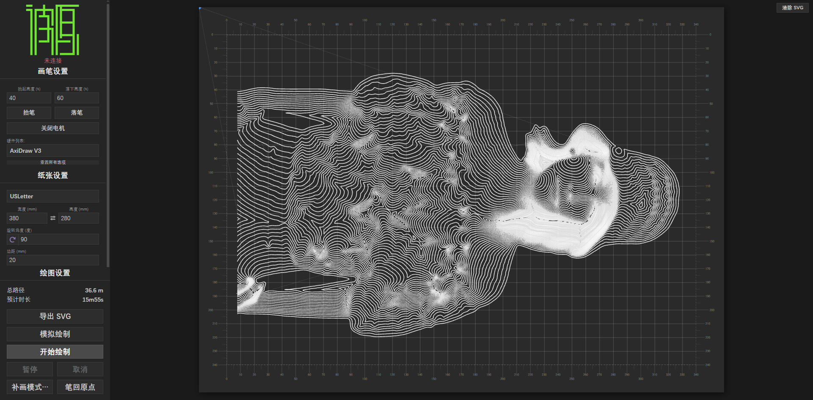

# Bit2AtomPlotGRBL

> 基于 Web 的 GRBL 笔式绘图仪控制系统 —— Z 轴步进抬笔，G-code 直驱

---

## 📋 项目定位

Bit2AtomPlotGRBL 是面向 **GRBL 固件体系笔式绘图仪**的现代化 Web 控制端：Arduino CNC Shield、grblHAL 板卡或任何运行 GRBL 1.1 / 0.9 / grblHAL 固件、以 **Z 轴步进电机抬落笔**的自制绘图仪。



通过浏览器即可完成从 SVG / G-code 加载、路径预览、参数调整到设备驱动的全流程操作，继承姊妹项目 EBB 版沉淀的全部长时绘制可靠性能力（暂停回溯重绘、区间补画、断连保护、任务日志），并新增 GRBL 生态的输入输出与调参能力。

---

## 🧬 与 EBB 版的关系（姊妹项目）

本项目的姊妹项目 [Bit2AtomPlotWebUI](https://github.com/lymanzhang/Bit2AtomPlotWebUI)（Bit2AtomBot）面向 AxiDraw / EBB 固件设备；本项目为 **GRBL 独立移植版**，两版本共享同一套设计与代码结构：

> 本项目仅支持 GRBL 体系设备，不含任何 EBB 兼容路径（`--driver` 仅 `grbl|sim`）；AxiDraw / EBB 设备请使用姊妹项目。

| 层次 | 共享情况 |
| --- | --- |
| SVG 解析（transform 矩阵引擎）、路径预处理（massager）、运动规划（Plan） | **共享设计**，毫米口径统一 |
| UI（React 全中文界面）、预览着色、回溯/补画交互 | 直接复用 |
| 执行层 | **全新实现**：`grbl.ts` 行协议 + `gcode.ts` Plan→G-code 转译 + Z 轴抬笔后端，替代 EBB 的 `LM`/`XM`/舵机指令 |
| 设备缓冲模型 | EBB 运动 FIFO → GRBL **字符计数流控**（RX 128 字节窗口 + planner 块缓冲） |

**架构决策（方案 B）**：主机仍生成完整 `Plan`（预览/回溯/统计沿用），执行层将 `Plan` 转译为 G-code 流式下发，速度曲线交给 GRBL planner 重新规划。取舍：放弃主机端恒加速精调，换取架构简单与广泛硬件适应性——加速度/限速调校由设备 `$110–$122` 参数负责。

---

## 功能特性

### 输入 / 输出

- **SVG 输入**（基线继承）— transform 完整支持（6 种变换函数任意深度复合，与浏览器原生精度一致）、真实物理尺寸自动检测、三态缩放（等比 / 1:1 / 自定义比例）+ 九宫格排版锚点 + 裁剪至边距
- **G-code 输入**（新增）— 直接导入第三方 G-code 文件（`.gcode/.nc/.tap/.ngc`）：`G0/G1` 直线、`G2/G3` 圆弧（I/J 增量圆心、R 半径式、整圆）、`M3/M4/M5` 与 Z 轴笔控、`G90/G91`、`G20/G21` 英寸换算；兼容 Inkscape GCodeTools（前导零）、LaserGRBL（M4 S 功率字）、J-Tech Photonizer 等方言，无法解析行有告警与统计留痕
- **SVG / G-code 导出**（新增）— 将路径优化 + 隐藏线去除 + 分层排版后的成果导出为 SVG 或标准 GRBL G-code（文件头注明 `$100–$102` 步进密度与限速建议，目标固件步/mm 须匹配否则比例失真）

### GRBL 执行与可靠性

- **字符计数流控** — 按 RX 缓冲区（默认 128 字节，可配 64–256）窗口流式发送，`ok`/`error` 回收额度；超长行提前拒绝不发送
- **固件能力自动探测** — 版本横幅 + `$I` 判型（grblHAL 伪装 `Grbl 1.1` 横幅时以 `[FIRMWARE:grblHAL]` 为准）、波特率按档位轮询（115200/9600/57600/230400/250000）；优先级 = 用户配置 > 探测值 > 预设档默认
- **参数助手** — 连接后读取设备 `$$`，与硬件档案换算值（XY/Z 步/mm）逐项对照告警；支持一键写入 `$100–$102`（白名单校验）与**反向同步**（以设备实值回填档案，推荐方向）
- **全命令超时纪律** — 常规 15s；超时即清队列 + 500ms 沉降期（孤儿 `ok` 丢弃防错位）；串口写失败立即中止全部挂起命令
- **断连保护** — USB 拔出/串口错误立即中止绘制、位置失效、UI 弹窗；服务端模式 5s 周期自动重连
- **Alarm 恢复路径** — `ALARM:` 行立即中止挂起命令（不空等超时），官方码中文描述 + 恢复引导（`$H` 归位 / `$X` 解锁）；绘制中 Alarm 不静默继续
- **软限位协同** — 设备开启 `$20` 时绘制前对照 `$130/$131` 行程提前拒绝超界任务
- **暂停回溯重绘 / 区间补画** — 漏画无需废弃整幅画：暂停后回溯到任意路径重绘；绘制结束后按区间补画；完成后自动归位
- **位置双源校验** — 暂停/收尾排空点对照主机跟踪位置与设备 WPos 实测，偏差 >1mm 记录日志并修正
- **任务日志** — 每次绘制/补画生成与源文件同名的日志文件，完整记录任务头/过程事件（含回溯、断连、Alarm）/任务尾统计

### 模拟绘制

- **内置 GRBL 模拟器** — 无设备即可全流程体验：逐行消费 G-code、planner 深度背压（默认 16 条，模拟真实固件）、虚拟状态回报、`$H`/`$X`/`$$`/`$I`、可注入 Alarm

---

## Z 轴配置指南

本项目以 **Z 轴步进电机**替代舵机抬笔。硬件设置分四组，随命名档案持久化：

| 参数组 | 内容 | 说明 |
| --- | --- | --- |
| 传动参数（XY） | 步距角 / 细分 / 同步轮齿数 / 齿距 | 换算步/mm 作为 `$100/$101` **建议值**（不参与主机运动学换算，固件 `$` 参数是绘制权威） |
| 传动参数（Z）与抬笔 | Z 步距角 / 细分 / 丝杆导程（或同步带齿距）、`zPenDownMm`（落笔 Z，通常 0）/ `zPenUpMm`（抬笔 Z，如 +5mm）/ `zFeedMmMin`（Z 进给） | Z 步/mm 对照 `$102`；UI 笔高滑杆 pct 0 = zPenUpMm、100 = zPenDownMm 线性映射 |
| 固件能力 | 固件种类（自动/GRBL 0.9/1.1/grblHAL）、波特率、RX 缓冲、`$H` 归位支持 | 自动探测 + 手动覆盖双入口 |
| 工作区 | 宽/高 (mm) | 参与绘制前超界校验（防撞轴）与预览标红 |
| 坐标系 | 机器原点角（左上/左下/右上/右下） | 决定 +X/+Y 方向；绘制起点按原点角跟随，预览标尺与原点标记同步联动，保证预览与实物空间关系一致 |

内置预设模板（「新建自定义」入口）：**GRBL 1.1 · 丝杆 Z** / **GRBL 1.1 · 同步带 Z** / **grblHAL · 丝杆 Z**。

> 落笔深度会因笔尖磨损/纸张厚度漂移，可随时调整 `zPenDownMm`；改参数后建议先用「参数助手」读取设备 `$$` 核对（或反向同步），再试绘 10mm 校准方格验证比例。

---

## 独特性与价值

| 维度     | 传统方案（Inkscape 插件 / CNC 工具链）   | Bit2AtomPlotGRBL                          |
| -------- | ------------------------- | ------------------------------------ |
| 依赖     | 需安装桌面软件            | 只需浏览器 + Node.js                 |
| 输入     | 通常仅 G-code 或仅 SVG    | SVG 与 G-code 双输入，统一经 Plan 管线 |
| 回溯/补画 | 无                        | 暂停回溯重绘 + 区间补画              |
| 硬件适配 | 单机锁定                  | 开放档案 + 3 预设档 + 能力自动探测   |
| 调参     | 手工对照文档              | 参数助手 `$$` 对照 / 一键写入 / 反向同步 |
| 平台兼容 | 视具体软件                | Windows/macOS/Linux（含树莓派）      |

**核心价值**：给 GRBL 绘图仪补齐「绘图仪视角」的完整工作流——SVG 渲染正确性、路径优化、隐藏线去除、漏画补救、防撞轴、任务日志，而不仅是一台 CNC。

---

## 运行环境

### 硬件要求

- 运行 GRBL 1.1 / 0.9 / grblHAL 固件的板卡（Arduino + CNC Shield、grblHAL 板卡等）
- Z 轴步进电机抬笔机构（丝杆或同步带传动）

### 软件要求

| 依赖    | 版本要求                | 说明              |
| ------- | ----------------------- | ----------------- |
| Node.js | >= 20.0.0               | JavaScript 运行时 |
| npm     | >= 9.x                  | 包管理器          |
| 浏览器  | Chrome / Edge / Firefox | 任意现代浏览器    |

### 支持平台

- ✅ Windows 10/11
- ✅ macOS
- ✅ Linux（含树莓派全系列）

---

## 启动方法

### 首次运行

```bash
# 1. 进入项目目录
cd Bit2AtomPlotGRBLWebUI

# 2. 安装依赖
npm install

# 3. 完整构建（服务器 + 前端）
npm run build

# 4. 启动服务（默认 GRBL 驱动）
node cli.mjs
```

### 日常启动

```bash
# 方式一：全流程（构建 → 启动）
npm start

# 方式二：快速启动（跳过构建，代码无变化时使用）
node cli.mjs
```

### 启动后

浏览器打开 **http://localhost:9080**

### 常用命令

| 命令                   | 说明                   |
| ---------------------- | ---------------------- |
| `npm start`            | 构建 + 启动            |
| `node cli.mjs`         | 直接启动（不重新构建） |
| `node cli.mjs --driver sim` | 内置 GRBL 模拟器（无硬件体验全流程） |
| `npm run build`        | 构建服务器 + 前端      |
| `npm run lint`         | 代码静态检查（biome，当前 0 告警） |
| `npm test`             | 运行测试套件（vitest，174 个用例） |

### 命令行批处理绘制

```bash
# 直接绘制 SVG 文件（不启动 Web 服务器）
node cli.mjs plot input.svg --driver grbl --paper-size A4 --margin 15

# 导入第三方 G-code 绘制
node cli.mjs plot drawing.gcode --driver grbl

# 无硬件模拟（内置 GRBL 模拟器）
node cli.mjs plot input.svg --driver sim
```

### 运行日志与任务日志

服务端每次启动自动将运行日志写入 `logs/`（自动保留最近 50 个）；每次绘制/补画生成与源文件同名的任务日志（`logs/[源文件名]__<时间戳>.log`），完整记录任务头（文件、模式、硬件、动作总数、预计时长/距离/速度）、进度心跳、暂停/恢复/回溯/断连/Alarm 事件与任务尾（实际时长/距离、结束状态）。

```bash
# 自定义日志目录（默认 logs/）
set BIT2ATOM_LOG_DIR=D:\plotter-logs && node cli.mjs

# 禁用文件日志（仅终端输出）
set BIT2ATOM_NO_FILE_LOG=1 && node cli.mjs
```

---

## 项目结构

```
Bit2AtomPlotGRBLWebUI/
├── cli.mjs                  # CLI 入口
├── build.mjs                # 前端构建脚本
├── package.json             # 项目配置
├── GRBL_PORT_PLAN.md        # 移植开发总纲（任务拆解与技术备忘）
├── src/
│   ├── ui.tsx               # React UI 组件（主界面）
│   ├── server.ts            # Express 服务器
│   ├── cli.ts               # CLI 参数解析（--driver grbl|sim）
│   ├── grbl.ts              # 【GRBL】行协议层（握手/流控/状态/Alarm）
│   ├── grbl-controller.ts   # 【GRBL】DeviceController 实现（执行循环）
│   ├── gcode.ts             # 【GRBL】Plan → G-code 转译层（方案 B 核心）
│   ├── gcode-import.ts      # 【GRBL】G-code 文件导入解析器
│   ├── export-gcode.ts      # 【GRBL】G-code 成果导出
│   ├── zaxis.ts             # 【GRBL】Z 轴抬笔后端
│   ├── simulator.ts         # 【GRBL】内置 GRBL 模拟器
│   ├── device-controller.ts # 【GRBL】设备控制接口抽象
│   ├── planning.ts          # 运动规划内核（Plan，毫米口径）
│   ├── massager.ts          # 路径预处理（缩放/裁剪/图层/消隐集成）
│   ├── drivers.ts           # 驱动抽象层（服务端 / WebSerial 直连）
│   ├── export-svg.ts        # SVG 成果导出
│   ├── hiding.ts            # 隐藏线去除
│   └── ...
├── docs/
│   ├── DEVICE_NOTES.md      # 目标设备调研记录（固件差异/传动换算/预设档依据）
│   └── RELEASE.md           # 发布流程
└── src/__tests__/           # 174 个测试用例（含 4 方言 round-trip 专项）
```

---

## 📋 更新日志

版本发布记录见 [CHANGELOG.md](CHANGELOG.md)。当前版本 **v0.1.0**：首个 GRBL 移植版发布。

---

## 📄 许可证

AGPL-3.0-only

> 本项目派生自 [SAXI](https://github.com/alexrudd2/saxi)（AGPL-3.0），故同样采用 AGPL-3.0 协议发布。基于本项目的修改与分发须遵循该协议的开源义务。

---

## 致谢

- [SAXI](https://github.com/alexrudd2/saxi) — 姊妹项目 Bit2AtomBot 的基础框架，本项目的 UI、规划层与工程化设计由此演进
- [Bit2AtomPlotWebUI](https://github.com/lymanzhang/Bit2AtomPlotWebUI) — EBB 版姊妹项目，本项目与其共享规划层设计
- [GRBL](https://github.com/grbl/grbl) 与 [grblHAL](https://github.com/terjeio/grblHAL) — 目标固件生态
- [axi](https://github.com/fogleman/axi) — 运动规划算法启发
